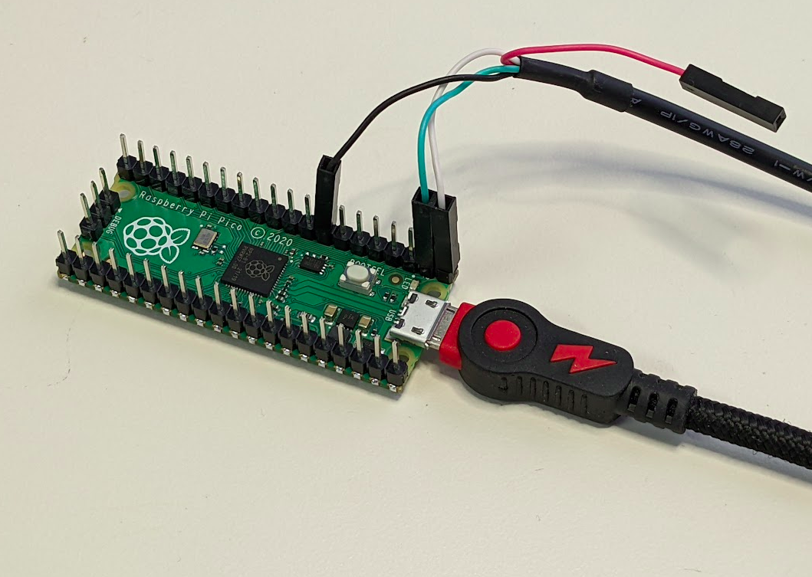

# libnklabs on Raspberry Pi Pico / RP2040

The Rasberry Pi Pico SDK uses CMake for its build environment.  This is an
added layer of obfuscation that we do not enjoy, so we've replaced it with a
simple Makefile.

To reverse engineer the build process we used CMake as usual, but added
"VERBOSE=1" to the make command so that we could observe what's going on.  This
is what we've learned:

* RP2040 has optimized floating point functions in its boot ROM.  To get gcc
  to use them, the linker's "--wrap" option is used.  This renames a
  particular symbol (for example, foo) with a different name (\_\_wrap_foo). 
  Anyway so you will see around of 150 of these options passed to the
  linker.

* A special tool must be built which converts the .elf output into a
  Microsoft UF2 file suitable for copying to the filesystem that shows up when you plug the Pi Pico into USB.
This lets you install your firmware by just copying this file to the fake drive.

* The image must include a second stage bootloader.  This is a separate program
built on its own.  A Python script pads out and adds a checksum to the
resulting image.  It is then converted into ASCII hex bytes in an assembly
language source file which is then assembled and included with your own
program.  A key point is that this bootloader must know the type of the
SPI-flash IC that is attached to the RP2040.  CMake produces a C header file
that indicates the board type.  See generated/pico/config_autogen.h,
pico-sdk/src/boards/include/boards, and pico-sdk/src/rp2_common/boot_stage2.

Otherwise the build process is straightforward, matching any other ARM
Cortex-M0 device.  Aside from ARM cross-compiler, the only prerequisites are
Python3 and a native C++ compiler.

CMake is used to select just the parts of the SDK you use in your project. 
For our Makefile, we just include all components.  If a component is unused,
the linker will not include it.  There are not so many components that
trimming them saves any build time.

The Raspberry Pi Pico SDK expects you to include it as a git submodule, but
we've included it as a subtree instead.  This means that you can use this
repository directly- no need for submodule initialization.

Basiclly to build you just clone this repository and type "make".

## Prerequisites

* ARM C/C++ cross-compiler
* Python3 (for 2nd stage bootloader checksum)
* Native C++ compiler (for ELF2UF2 tool)

## Build

Just type:

	make

To install the image on the Raspberry Pi Pico board:

1. Unplug Raspberry Pi Pico's USB cable

2. While holding the BOOTSEL button in, connect the Raspberry Pi Pico USB to
your computer.  The board should show up as a USB drive.

3. Copy the pico.uf2 file to /media/$USER/RPI-RP2

The libnklabs CLI should come up on the UART.  The UART uses GP0 (Tx) and
GP1 (Rx)- see the photo above.  Connect to it with a USB to 3.3V serial
adapter cable.  Then you can issue these commands:

	sudo apt-get install picocom

	picocom --baud 115200 /dev/ttyUSB0

You should see:

~~~
[Initialize] Work queue
[Initialize] Database
[Initialize] Command Line Interface
[Initialize] Begin main loop
>
>help
help <name> for help with a specific command

Available commands:

dbase                     Database store
echo                      Control command echoing
help                      Help command
info                      Display serial number and firmware information
mcuflash                  Read/write flash memory
mem                       Read/write memory
power                     Show/control power mode
reboot                    Reboot system
work                      Show work queue
ymodem                    Transfer files over serial
>
>
~~~

